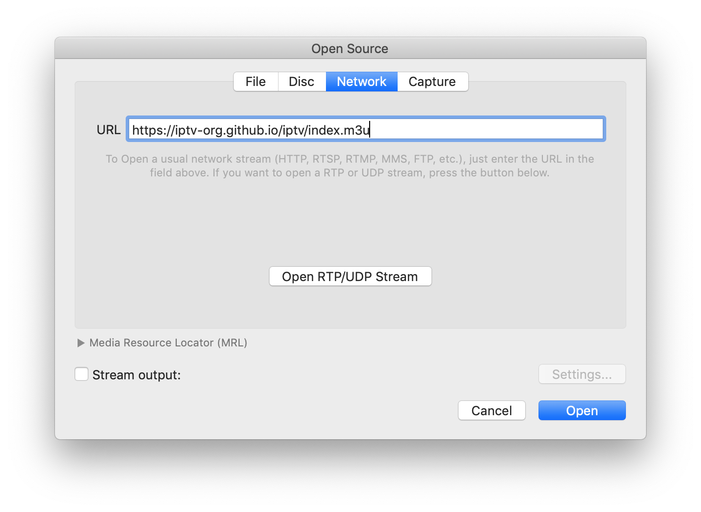

# IPTV

Collection of 8000+ publicly available IPTV channels from all over the world. 

Internet Protocol television (IPTV) is the delivery of television content over Internet Protocol (IP) networks. 

## Usage

To watch IPTV you just need to paste this link `https://iptv-org.github.io/iptv/index.m3u` to any player with support M3U-playlists.

Also you can instead use one of these playlists:

Or select one of the playlists from the list below.

## Playlists by category

<table>
	<thead>
		<tr><th align="left">Category</th><th align="right">Channels</th><th align="left">Playlist</th></tr>
	</thead>
	<tbody>
		
		<tr><td align="left">Zimbabwe</td><td align="right">2</td><td align="left" nowrap><code>https://iptv-org.github.io/iptv/countries/zw.m3u</code></td><td align="left"></td></tr>
	</tbody>
</table>

